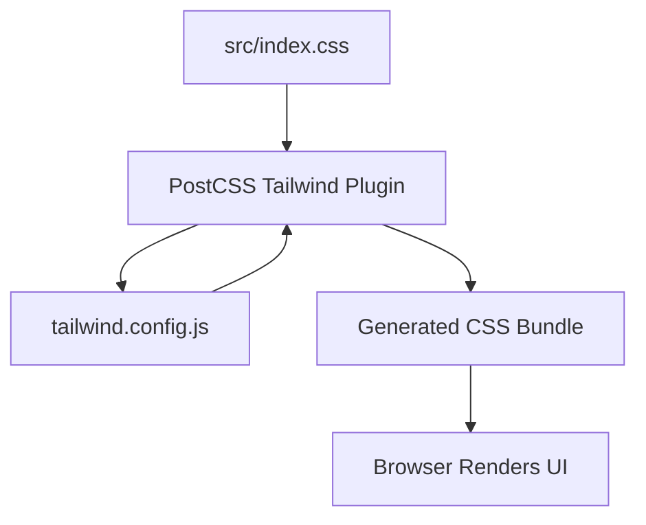

# src/index.css

> **Source File:** [src/index.css](https://github.com/tableau-frontend/blob/main/src/index.css)  
> **Repository:** `tableau-frontend`  
> **Branch:** `main`

### Overview
This file serves as the primary entry point for integrating the Tailwind CSS framework into the application. It imports Tailwind's generated styles for base, component, and utility classes, establishing the foundational styling for the user interface.

### Architecture & Role
Architecturally, this file belongs to the presentation layer, specifically handling global styling. Its role is to pull in the pre-compiled CSS from the Tailwind framework during the build process, making the utility-first classes available throughout the application. It acts as the global stylesheet for the project.

### Key Components
The file consists of three essential `@tailwind` directives:
- `@tailwind base;`: Injects Tailwind's base styles, which are a carefully curated set of opinionated browser resets and default styles.
- `@tailwind components;`: Injects any component classes defined within the project or provided by Tailwind plugins.
- `@tailwind utilities;`: Injects all of Tailwind's utility classes, enabling rapid UI development through atomic styling.

### Execution Flow / Behavior
During the application's build process, a PostCSS pipeline (which includes the Tailwind CSS plugin) processes this file. The `@tailwind` directives are replaced by the actual CSS rules generated by Tailwind, based on the project's configuration and the HTML/JavaScript files scanned for class usage. The resulting compiled CSS bundle is then linked into the main HTML document, applying styles at runtime when the application loads in the browser.

### Dependencies
- **Internal:** Relies on the project's `tailwind.config.js` file for configuration and customization of the Tailwind CSS output.
- **External:** Depends on the Tailwind CSS framework itself and the PostCSS ecosystem for compilation.

### Design Notes
This approach leverages Tailwind CSS for a utility-first styling methodology, promoting rapid development and consistent design. A key design decision is the delegation of most styling concerns to atomic utility classes rather than custom CSS. A trade-off is the requirement for a build step to process the Tailwind directives and purge unused CSS, which adds complexity to the development workflow but results in smaller production bundles. Future improvements could involve optimizing the purging configuration for even smaller CSS footprints.

### Diagram (Optional)
