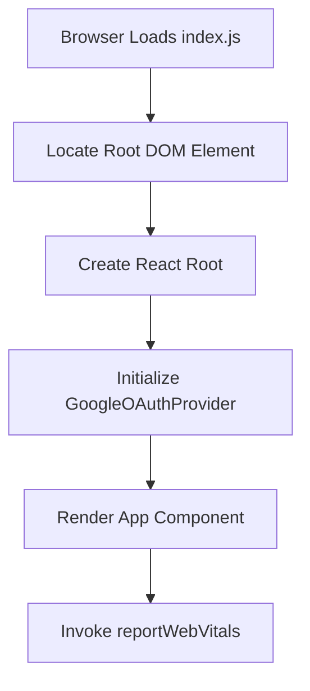

# src/index.js

> **Source File:** [src/index.js](https://github.com/tableau-frontend/blob/main/src/index.js)  
> **Repository:** `tableau-frontend`  
> **Branch:** `main`

### Overview
This file serves as the primary entry point for the React application. It initializes the React rendering environment and mounts the root application component into the DOM.

### Architecture & Role
This file operates at the application's bootstrapping layer, functioning as the main orchestrator for rendering the user interface. It establishes the root of the React component tree and integrates essential top-level providers.

### Key Components
- `ReactDOM.createRoot`: Initiates a concurrent React root for rendering.
- `root.render`: Mounts the React component hierarchy into the specified DOM element.
- `GoogleOAuthProvider`: A React context provider that supplies Google OAuth client configuration to its child components.
- `App`: The main application component, representing the entire UI.
- `reportWebVitals`: A function designed to measure and report core web vital metrics.

### Execution Flow / Behavior
The script executes upon application load:
1. It identifies the DOM element with the ID "root".
2. A new React root is created using `ReactDOM.createRoot`, associating it with the identified DOM element.
3. The `App` component is rendered inside the `GoogleOAuthProvider`, which itself is rendered into the React root.
4. The `reportWebVitals` function is invoked to collect performance data.
5. The `React.StrictMode` component is present in the code but commented out, indicating it is currently inactive.

### Dependencies
- `react`: Provides core React library functionalities.
- `react-dom/client`: Offers client-specific methods for web-based DOM manipulation and rendering.
- `./index.css`: Imports global styles for the application.
- `./App`: Imports the main application component, which forms the root of the UI.
- `./reportWebVitals`: Imports a utility function for performance monitoring.
- `@react-oauth/google`: An external library providing components for Google OAuth integration.

### Design Notes
- The application leverages `ReactDOM.createRoot`, indicating a modern React setup compatible with concurrent features.
- The `GoogleOAuthProvider` is placed at the highest level of the component tree, ensuring that the Google OAuth client ID is globally available to all descendant components.
- The presence of `React.StrictMode` (though commented out) suggests an intent for strict development mode that has been temporarily or permanently disabled.
- Integration of `reportWebVitals` indicates a proactive approach to monitoring and optimizing application performance metrics.

### Diagram (Optional)
