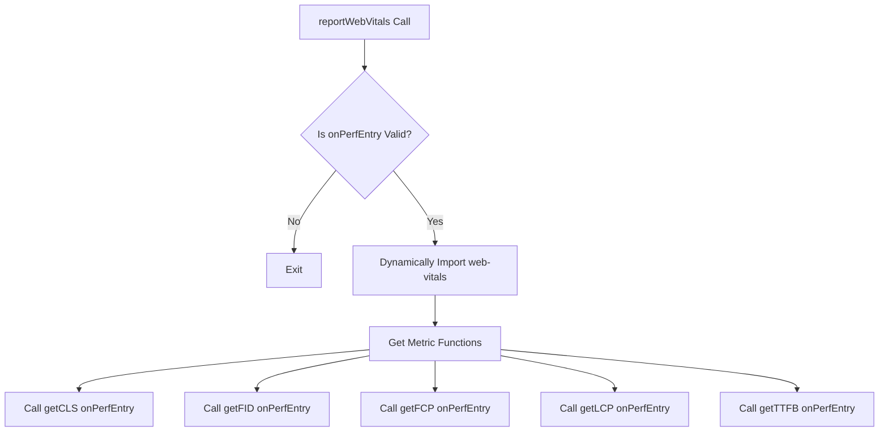

# src/reportWebVitals.js

> **Source File:** [src/reportWebVitals.js](https://github.com/tableau-frontend/blob/main/src/reportWebVitals.js)  
> **Repository:** `tableau-frontend`  
> **Branch:** `main`

### Overview
This file defines a utility function responsible for collecting and reporting Web Vitals metrics for a web application. It dynamically imports the `web-vitals` library to measure various performance metrics and reports them via a provided callback function.

### Architecture & Role
Architecturally, this file acts as a client-side performance monitoring utility. It resides in the presentation layer and is typically invoked once during the application's initialization phase (e.g., in the main `index.js` or `App.js` file of a React application). Its role is to bridge the application's runtime with the `web-vitals` measurement mechanisms, making performance data available to an external reporting system or console.

### Key Components
- **`reportWebVitals(onPerfEntry)` function**: The primary export of this file. It accepts a single argument, `onPerfEntry`, which is expected to be a callback function.

### Execution Flow / Behavior
When the `reportWebVitals` function is called:
1.  It first checks if the `onPerfEntry` argument is provided and is a function. If not, the function exits without further action.
2.  If `onPerfEntry` is a valid function, it dynamically imports the `web-vitals` library.
3.  Upon successful import, it destructures and retrieves specific web vital measurement functions: `getCLS`, `getFID`, `getFCP`, `getLCP`, and `getTTFB`.
4.  Each of these measurement functions is then called, passing the original `onPerfEntry` callback. This sets up the `web-vitals` library to report metric data through `onPerfEntry` as metrics become available.

### Dependencies
- **`web-vitals` (external library)**: This is a runtime dependency that is dynamically imported. It provides the core functionality for measuring various performance metrics such as Cumulative Layout Shift (CLS), First Input Delay (FID), First Contentful Paint (FCP), Largest Contentful Paint (LCP), and Time to First Byte (TTFB).

### Design Notes
- **Dynamic Import**: The `web-vitals` library is imported dynamically (`import('web-vitals').then(...)`). This design decision defers the loading of the `web-vitals` module until it's actually needed and its prerequisites (a valid `onPerfEntry` callback) are met. This can improve the initial load performance of the application by not bundling the `web-vitals` library with the main application bundle if it's not strictly necessary or if the reporting functionality is conditionally enabled.
- **Callback-based Reporting**: The use of an `onPerfEntry` callback allows the `reportWebVitals` function to be generic and decoupled from any specific reporting mechanism (e.g., sending data to an analytics service, logging to the console).

### Diagram (Optional)
